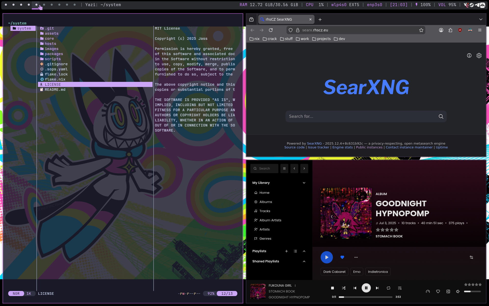

## My nixos config file


### Configuration

* Add your system configuration in `flake.nix` under `nixosConfigurations`:
  ```nix
  <your-username> = mkSystem {
    userName = "your-username";
    hostName = "YourHostname";
    fullName = "Your Name";
  };
  ```
* Create a corresponding directory: `hosts/your-username/`
* Run ./scripts/generate-hardware-info.sh to generate hardware-configuration.nix
* Run ./scripts/install-images.sh to copy installation images to ~/images/
* Set up secrets management (see below)

### Packages
* home manager packages are in hosts/<your-username>/packages/hm-packages.nix
* NixOS packages are in hosts/<your-username>/packages/nixos-packages.nix
* System modules are in core/
* Fonts are in hosts/<your-username>/fonts.nix
* Extra packages are in packages/

### Usage
* Packages are managed via home-manager and flakes.
* To apply changes, run `rbld` (or `nixos-rebuild switch --flake ~/system#<userName> --sudo`).

### Secrets Management (sops-nix)

**Secrets Setup (Optional):**
1. Generate your age encryption key:
   ```bash
   mkdir -p ~/.config/sops/age
   nix-shell -p age --run "age-keygen -o ~/.config/sops/age/keys.txt"
   ```
2. Copy the public key from the output
3. Update `.sops.yaml` with your public key (replace the existing one)
4. Copy the example secrets file and add your secrets:
   ```bash
   cp hosts/<user>/secrets/secrets.yaml.example ~/.config/sops/secrets.yaml
   # Edit the file and add your actual secrets
   ```
5. Encrypt the secrets file:
   ```bash
   nix-shell -p sops --run "sops -e -i ~/.config/sops/secrets.yaml"
   ```

### Keybindings

| Keybind | Action |
|---------|--------|
| **Windows** | |
| `Super + Return` | Launch terminal |
| `Super + Shift + Return` | Launch floating terminal |
| `Super + Q` | Close window |
| `Super + Shift + Q` | Kill window |
| `Super + H` | Hide/minimize window |
| `Super + Shift + H` | Show hidden windows menu |
| `Super + F` | Toggle fullscreen |
| `Super + T` | Set window to tiled |
| `Super + Shift + T` | Set window to pseudo-tiled |
| `Super + Shift + F` | Set window to floating |
| **Navigation** | |
| `Super + Space` | Open application launcher |
| `Alt + Tab` | Switch to last focused desktop |
| `Super + Ctrl + Left/Right` | Focus next/previous window |
| `Super + Left/Right` | Focus next/previous desktop |
| `Super + Ctrl + Up/Down` | Focus next/previous monitor |
| **Moving Windows** | |
| `Super + Shift + Left/Right` | Move window to next/previous desktop |
| `Super + Shift + Up/Down` | Move window to next/previous monitor |
| `Super + Alt + Left/Right` | Swap with next/previous window |
| **Desktops** | |
| `Super + Alt + N` | Add new desktop |
| `Super + Alt + R` | Remove current desktop |
| **Screenshots** | |
| `Super + Shift + S` | Screenshot full screen |
| `Super + S` | Screenshot selected area |
| **System** | |
| `Super + L` | Lock screen |
| `Super + V` | Open clipboard history |
| `XF86AudioRaiseVolume` | Volume up |
| `XF86AudioLowerVolume` | Volume down |
| `XF86AudioMute` | Toggle mute |
| `XF86MonBrightnessUp` | Brightness up |
| `XF86MonBrightnessDown` | Brightness down |

